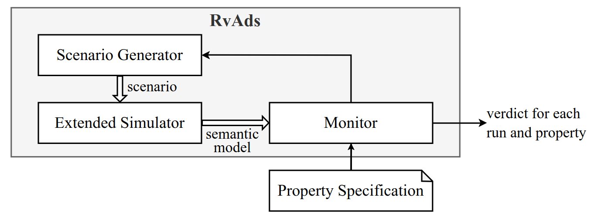
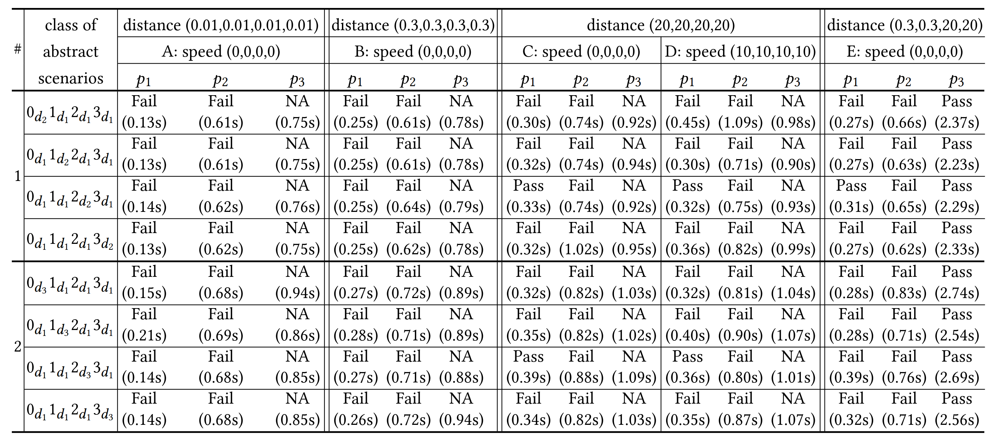
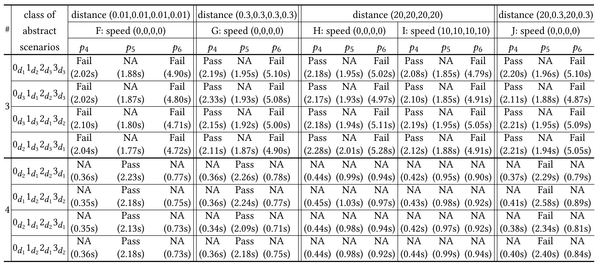
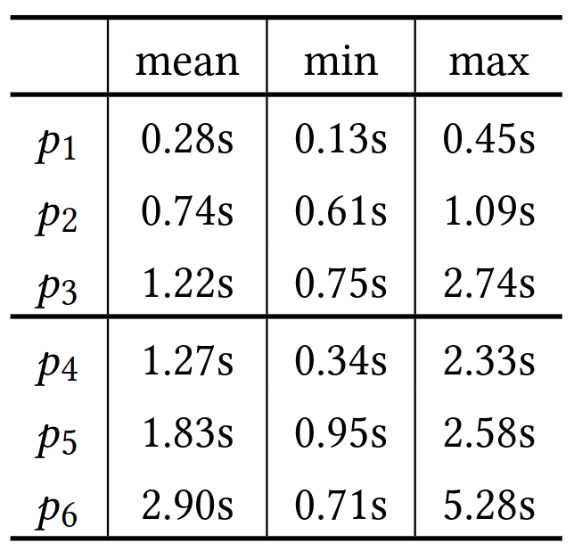

# RvADS: Simulation-based Validation for Autonomous Driving Systems

RvADS is a simulation-based validation framework for autonomous driving systems that contains three components: 1) Simulator, 2) Scenario Generator, and 3) Monitor.

 

[toc]

## Experimental Results

There are four groups of experimental results located in [`experimental_results/`](./experimental_results), including `4-way-stop`, `4-way-traffic-light`, `T-way-stop`, and `T-way-traffic-light`. They are the raw data for the experiments listed in the paper and the attached video. 


### Verdict Content

A verdict of a scenario contains the following information for each property:

- A final verdict indicated by `True`, `False`, or `None`, which corresponds to Pass, Fail, or NA in the paper.
- The satisfaction of the premise indicated by `True` or `False`, and a list of clauses that satisfy the premise if the satisfaction is `True`.
- The satisfaction of the whole formula indicated by `True` or `False`, and a list of clauses that result in the property violation if the satisfaction is `False`.
- The time cost of checking the property.

Here is an instance of the verdict.

```
* one-car-in-junction: True
- premise: True
-- ♢[[c0 @ J14]]
-- ♢[[c1 @ J14]]
-- ♢[[c2 @ J14]]
-- ♢[[c3 @ J14]]
- formula: True
# Time cost: 0.30611634254455566 s
==============
* right-of-priority: False
- premise: True
-- ♢[[[c3 @ en(J14.2)] ∧ [c2 @ en(J14.0)] ∧ [wt(c3) = wt(c2)]]]
-- ♢[[[c1 @ en(J14.3)] ∧ [c0 @ en(J14.1)] ∧ [wt(c1) = wt(c0)]]]
- formula: False
-- □[[[[c3 @ en(J14.2)] ∧ [c2 @ en(J14.0)] ∧ [wt(c3) = wt(c2)]] → [[N [c2 @ en(J14.0)]] U [c3 @ J14]]]]
-- □[[[[c1 @ en(J14.3)] ∧ [c0 @ en(J14.1)] ∧ [wt(c1) = wt(c0)]] → [[N [c0 @ en(J14.1)]] U [c1 @ J14]]]]
# Time cost: 0.6471295356750488 s
==============
* fifo-priority: True
- premise: True
-- ♢[[[c2 @ en(J14.0)] ∧ [c1 @ en(J14.3)] ∧ [wt(c2) < wt(c1)]]]
-- ♢[[[c3 @ en(J14.2)] ∧ [c1 @ en(J14.3)] ∧ [wt(c3) < wt(c1)]]]
- formula: True
# Time cost: 2.2947375774383545 s
==============
# Total time cost: 3.247983455657959 s
```


## Statistics of Time Cost

**The time cost of property checking for the 4-way stop junction experiment** 
(the time limit for each simulation run is 30 seconds where Δt is 0.01s)




**The time cost of property checking for the 4-way traffic light junction experiment**

(the time limit for each simulation run is 40 seconds where Δt is 0.01s)




**The average, minimal, and maximal time cost of property checking**
(Note that the time cost of the property checking for the 4-way stop junction and traffic light junction cannot be compared with each other, as they have different simulation durations).



**Discussion**

RvADS first checks the applicability of a scenario against a property by validating its subformula. If the property is not applicable, RvADS returns NA result without validating the whole formula. Therefore, the time costs for NA cases are low.

We can observe that for the same scenario, the time cost increases when a property involves more temporal operators and variables. That comes from the increased size of the unfolded formulas.

Moreover, the number of simulation steps for scenarios with the traffic light junction is larger than that with the stop junction. This fact leads to the increased size of the constructed semantic model. Therefore, the time cost for scenarios with the traffic light junction is higher than that with the stop junction.

## Usage

### Download

The code for RvADS and Extended Simulator can be downloaded at https://figshare.com/collections/RvADS/6589393.

### Requirements

RvADS has been tested in the following environments. Please confirm compatibility when using other software versions.

- **Ubuntu 22.04 (x86_64)**
- **Bazel release 5.2.0**: Please download it [here](https://github.com/bazelbuild/bazel/releases/tag/5.2.0) and add it to `$PATH`, or refer https://bazel.build/ to install.
- **Python 3.9** 
  (PyPy is recommended for performance reasons. The official Python interpreter also works but with  efficiency loss)
- **Python Packages**:
  - **LGSVL Python API 2021.3**: Please refer [here](https://github.com/lgsvl/PythonAPI) for installation.
  - **Z3 Solver**: `pip install z3-solver`


### Simulator

The executable Extended Simulator can be downloaed [here](https://figshare.com/collections/RvADS/6589393) (`extended-simulator.zip`). Please run

````shell
$ ./run-simulator.sh
````

after unzipping and click the start button.

The code for the extension is located in `svl-extension/`. One can also follow the instructions detailed [here](https://www.svlsimulator.com/docs/installation-guide/build-instructions/) to build it along with the simulator.


### Scenario Generator

After starting the Simulator, scenarios for a 4-way stop junction can be generated using the following command. The simulated runs will be saved to `experimental_results/new_scenarios` as the argument specified.

```shell
$ bazel run -- //validation:generate \
            --type stop_sign \
            --way 4 \
            --candidate_distance 0.3 20 \
            --candidate_speed 0 \
            --time_limit 30 \
            $PWD/experimental_results/new_scenarios
# Note that absolute path is needed
```


Here is the detailed usage of  `generate`:

```
usage: generate [-h] --type {stop_sign,traffic_light} --way {T,4} 
                     --candidate_distance CANDIDATE_DISTANCE [CANDIDATE_DISTANCE ...] 
                     --candidate_speed CANDIDATE_SPEED [CANDIDATE_SPEED ...]
                     --time_limit TIME_LIMIT
                     RUNS_DIR

positional arguments:
  RUNS_DIR              absolute path to save the simulated runs

optional arguments:
  -h, --help            show this help message and exit
  --type {stop_sign,traffic_light}
                        type of the junction
  --way {T,4}           way of the junction
  --candidate_distance CANDIDATE_DISTANCE [CANDIDATE_DISTANCE ...]
                        candidate initial distance to the entrance of the junction
  --candidate_speed CANDIDATE_SPEED [CANDIDATE_SPEED ...]
                        candidate initial speed
  --time_limit TIME_LIMIT
                        maximum simulation time
```


### Monitor

The following command produces the verdicts to `experimental_results/4-way-stop-verdicts` for all the simulated runs located in `experimental_results/4-way-stop`, where the scenarios are for a 4-way stop junction.

```shell
$ bazel run -- //validation:check --type stop_sign --way 4 \
        $PWD/experimental_results/4-way-stop \
        $PWD/experimental_results/4-way-stop-verdicts
# Note that absolute paths are needed
```

Multiple runs can be checked in parallel by specifying the argument `pool_size` 
(16 runs will be checked simultaneously for the following case).

```shell
$ bazel run -- //validation:check --type stop_sign --way 4 --pool_size 16 \
        $PWD/experimental_results/4-way-stop \
        $PWD/experimental_results/4-way-stop-verdicts
```

Note:

- PyPy is recommended for this step. It will significantly improve the checking performance.

- (Running on CentOS may have this problem) If the execution is abnormal, please ensure `third-party/ltl2fsm/ltl2fsm "a"` can be executed correctly. Otherwise, please refer [here](https://ltl3tools.sourceforge.net/) to replace the third-party tools with the executable ones.


Here is the detailed usage of `check`:

```
usage: check [-h] --type {stop_sign,traffic_light} --way {4,T} [--pool_size POOL_SIZE] RUNS_DIR VERDICTS_DIR

positional arguments:
  RUNS_DIR              absolute path to the simulated runs
  VERDICTS_DIR          absolute path to save the verdicts

optional arguments:
  -h, --help            show this help message and exit
  --type {stop_sign,traffic_light}
                        type of the junction
  --way {4,T}           way of the junction
  --pool_size POOL_SIZE
                        process pool size N (allow simultaneous checking of N runs, default=1)
```


## License

AGPL v3.0

(Please know the implication of LICENSE before using or contributing to the code)

