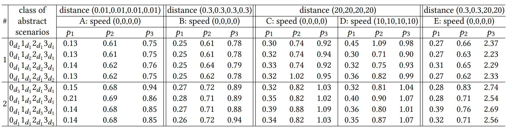
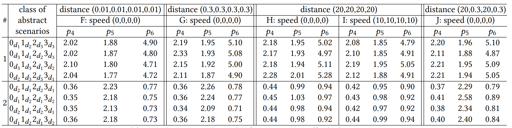
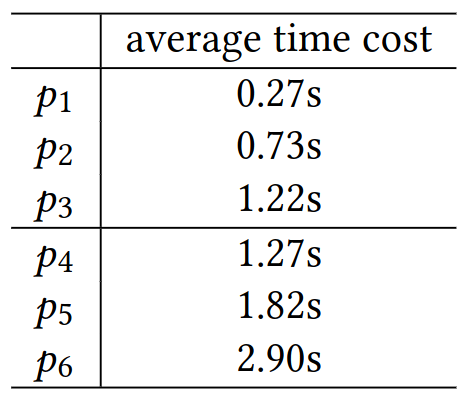

# Experimental Data

## File Organization

### Scenario Groups

Four groups of experimental data are included:

- `4-way-stop` are the simulated runs for the 4-way stop junction listed in the paper.
- `4-way-traffic-light` are the simulated runs for the 4-way traffic light junction listed in the paper.
- `T-way-stop` are the simulated runs for the T-way stop junction shown in the attached video.
- `T-way-traffic-light` are the simulated runs for the T-way traffic light junction shown in the attached video.

### Scenario Files

#### Three Types of Files

Each folder contains a set of files which name are encoded as 

- `scenario_{parameters}.bin` which is the binary file for the simulated run,
- `scenario_{parameters}_info.txt` which is the simulation information of the scenario, or
- `scenario_{parameters}_verdict.txt` which is the verdict for the scenario.

#### Scenario Parameters

The parameter contains 4 parts: `{base_abstract_scenario}_{distances}_{speeds}_{rotation}`, where `base_abstract_scenario` and `rotation` determine the real abstract scenario corresponding to this concrete scenario. For example, if `base_abstract_scenario` is `d_1,d_1,d_2` and `rotation` is `r=1`, then the real abstract scenario is `base_abstract_scenario` after one rotation, which is `1_{d_1}2_{d_1}0_{d_2} = 0_{d_2}1_{d_1}2_{d_1}`

#### Verdict Content

An verdict file contains the following information for each property:

- Final verdict represented as `True`, `False`, or `None` which corresponding to "Pass", "Fail", or "NA" in the paper.
- The satisfaction of the premise represented as `True` or `False` along with a list showing which clauses satisfy the premise.
- The satisfaction of the whole formula represented as `True` or `False` along with a list showing which clauses violate the formula.
- The time cost of checking the property.

Here is an instance of the verdict.

```
* one-car-in-junction: True
- premise: True
-- ♢[[c0 @ J14]]
-- ♢[[c1 @ J14]]
-- ♢[[c2 @ J14]]
-- ♢[[c3 @ J14]]
- formula: True
# Time cost: 0.30611634254455566 s
==============
* right-of-priority: False
- premise: True
-- ♢[[[c3 @ en(J14.2)] ∧ [c2 @ en(J14.0)] ∧ [wt(c3) = wt(c2)]]]
-- ♢[[[c1 @ en(J14.3)] ∧ [c0 @ en(J14.1)] ∧ [wt(c1) = wt(c0)]]]
- formula: False
-- □[[[[c3 @ en(J14.2)] ∧ [c2 @ en(J14.0)] ∧ [wt(c3) = wt(c2)]] → [[N [c2 @ en(J14.0)]] U [c3 @ J14]]]]
-- □[[[[c1 @ en(J14.3)] ∧ [c0 @ en(J14.1)] ∧ [wt(c1) = wt(c0)]] → [[N [c0 @ en(J14.1)]] U [c1 @ J14]]]]
# Time cost: 0.6471295356750488 s
==============
* fifo-priority: True
- premise: True
-- ♢[[[c2 @ en(J14.0)] ∧ [c1 @ en(J14.3)] ∧ [wt(c2) < wt(c1)]]]
-- ♢[[[c3 @ en(J14.2)] ∧ [c1 @ en(J14.3)] ∧ [wt(c3) < wt(c1)]]]
- formula: True
# Time cost: 2.2947375774383545 s
==============
# Total time cost: 3.247983455657959 s
```


## Statistics of Time Cost

Time cost (in seconds) of property checking for the 4-way stop junction experiment:




Time cost (in seconds) of property checking for the 4-way traffic light junction experiment:




Average time cost for different properties. (Note that the properties for 4-way stop junction and the property for traffic light junction cannot be compared with each other, as they have different simulation time).

